# createShortVideo

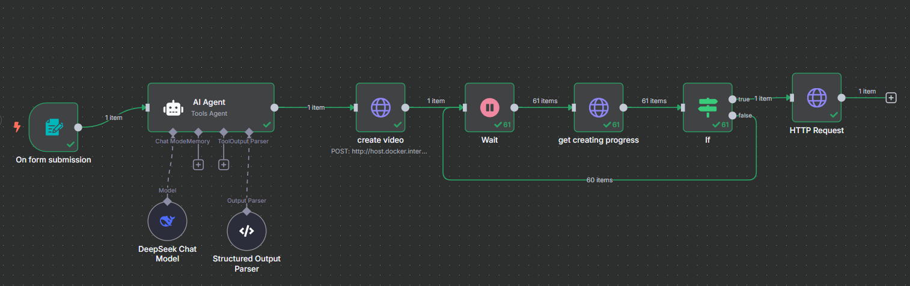

## Workflow

- 表单入口: 用户输入自定义短视频主题，提交表单
- Agent: 文案策划师角色，针对用户的 topic 撰写短视频文案，输出 { title, content } 的结构
- MoneyPrinterTurbo: 开源短视频生成工具，能够根据用户输入的主题或关键词全自动生成包含文案、素材、字幕和背景音乐的高清短视频‌
- Polling: 轮询拉取 MoneyPrinterTurbo 的视频生成进度，等到 progress 100%
- Download: 下载 video


## 表单入口

选择 form 入口节点，添加 form field

- topic: 主题

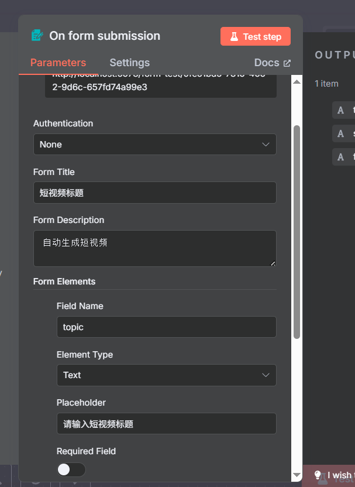
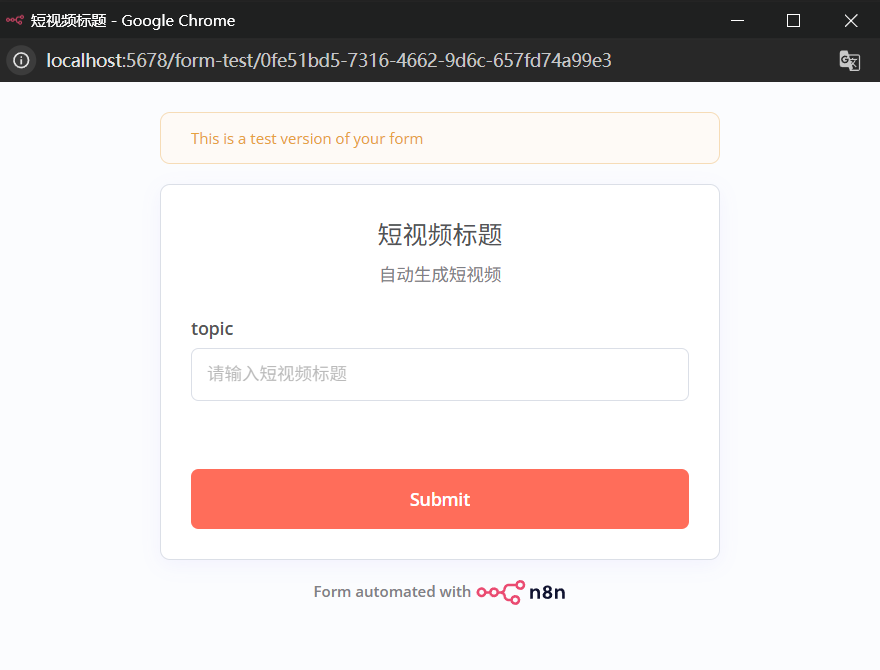

## Agent

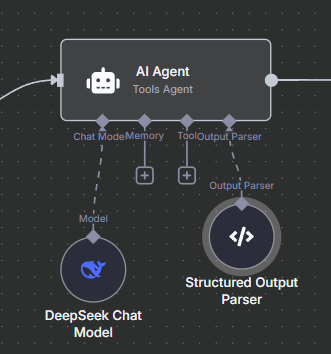

- user prompt: 按照要求生成内容
- required specific output format: 要求格式化 output
- system prompt:

```json
你是一位资深自媒体运营专家兼文案策划师，深谙 YouTube Shorts 平台调性与用户心理。

任务：针对“{{ $json.topic }}”主题，撰写一份 100-120字 的短视频文案，并给出不超过10字的标题。

要求：

1.模仿以下结构：

- 【钩子】3秒内抓住注意力

- 【核心要点】3个关键卖点或利益点

- 【核心要点】3个关键卖点或利益点
【CTA】一句行动号召

2.严格输出 JSON，且仅包含 title 和 content 两个字段：
{
  "title": "在此填入视频标题",
  "content": "在此填入文案内容"
}

```

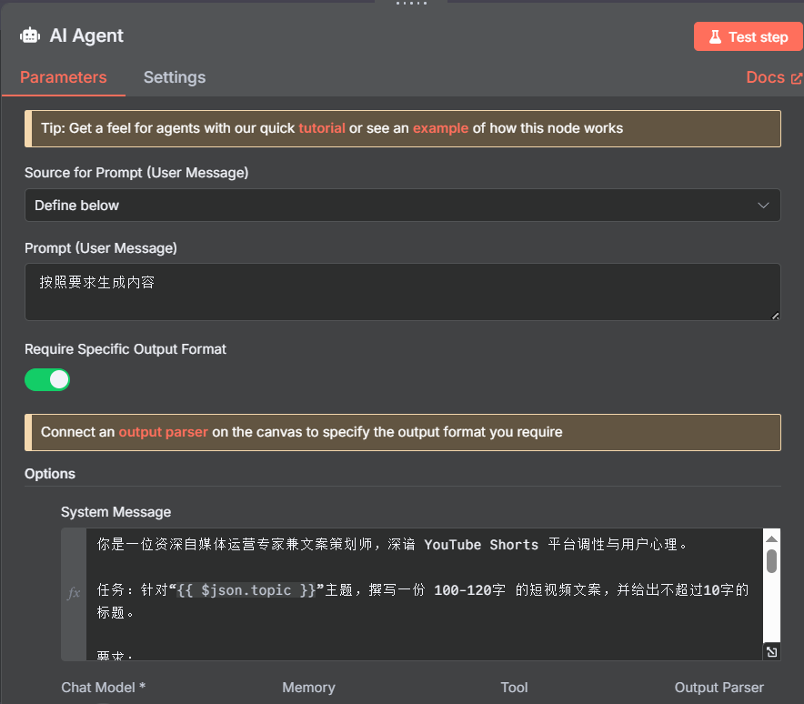

- model: 可选 `DeepSeek`、`Gemini` 等

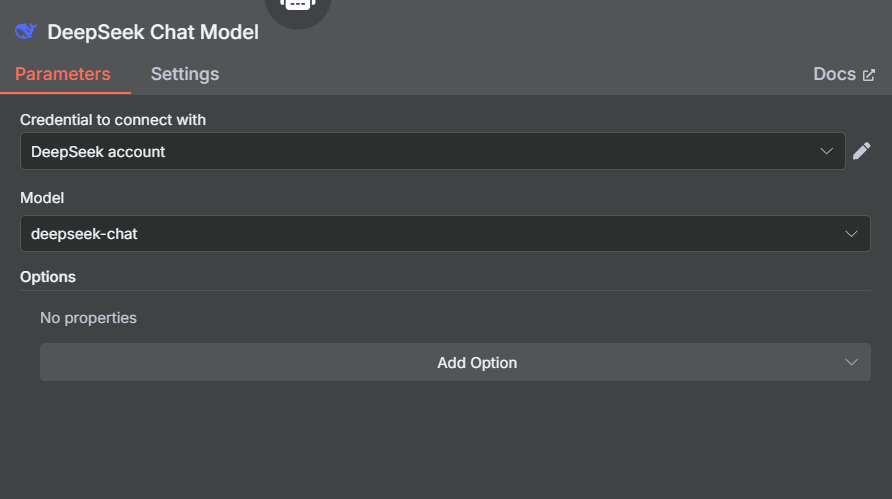

- 指定 output 格式

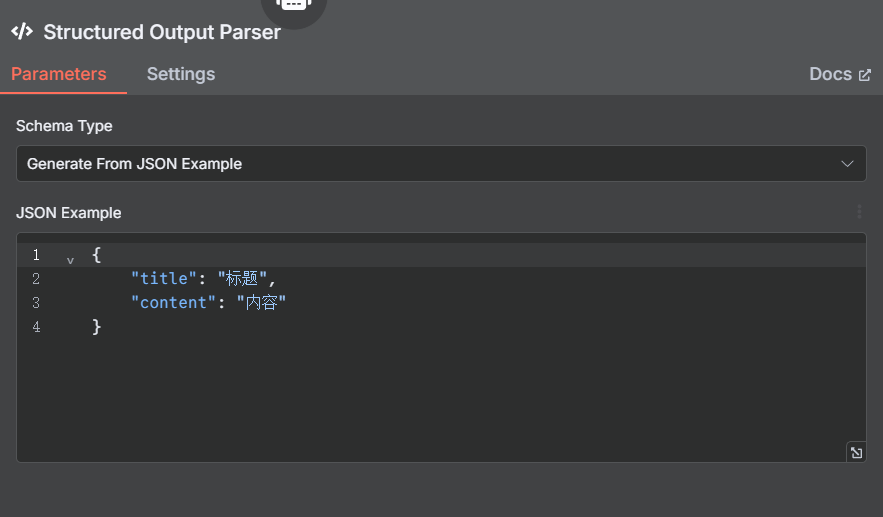

## MoneyPrinterTurbo

### 项目准备

- git clone 项目: [MoneyPrinterTurbo github](https://github.com/harry0703/MoneyPrinterTurbo)

- 配置 `config.toml`: 
    - 配置视频字幕
    - 拷贝根目录下 `config.example.toml`，重命名 `config.toml`
    - 找到 `subtitle_provider` 部分，copy 到 [app] 下
    - 删除原来的 `subtitle_provider` 部分

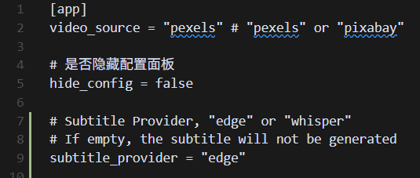

- docker python 镜像: 根据 `Dockerfile` 下的信息，需要安装指定版本 python，`docker pull python:3.11-slim-bullseye`

- 启动: `docket-compose up --build` (过程中会装很多依赖，可能因为网络访问国外资源不稳定等原因失败，连好 VPN 多试几次)

- 访问 web 页面: `http://localhost:8501/`

### 配置基础信息

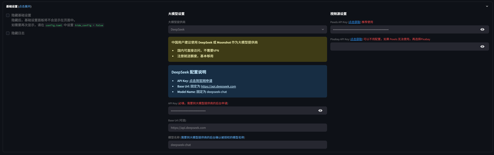

- 大模型: 
    - 选择: `DeepSeek`、`Gemini` 等，获取 api key 和 model name
    - 目的: 根据用户配置的主题等自动生成视频文案、关键词等

- 视频源设置:
    - 选择: `Pexels`
    - api key 获取: [https://www.pexels.com/](https://www.pexels.com/)
    - 目的: MoneyPrinterTurbo 会去 pexels 里找图片、视频资源，将它们拼接组合生成短视频

### 配置视频信息

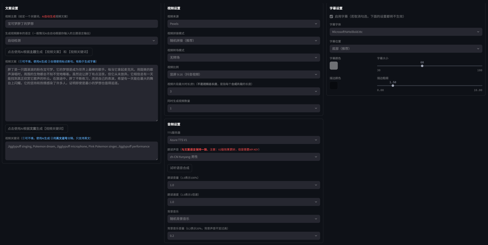

注:
- 文案用的语言，需要与`音频设置`中`朗读声音`语言保持一致，不能文案是中文，选的声音却是英文的人声

### config.toml

各个信息配置后，会发现 `config.toml` 内的结构自动更新了

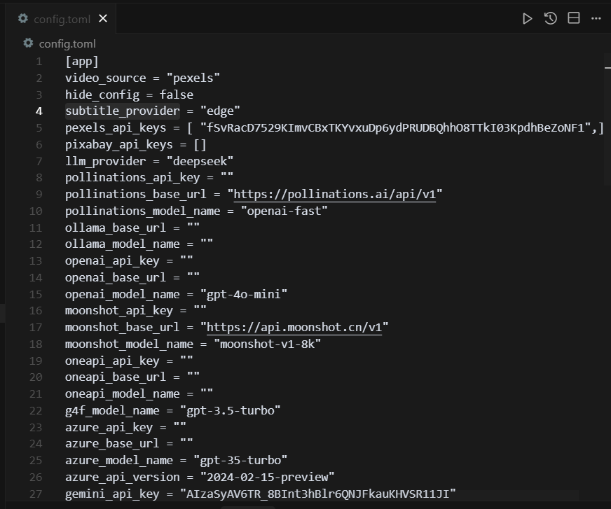

### 测试生成视频


### API 文档

`http://localhost:8080/docs`

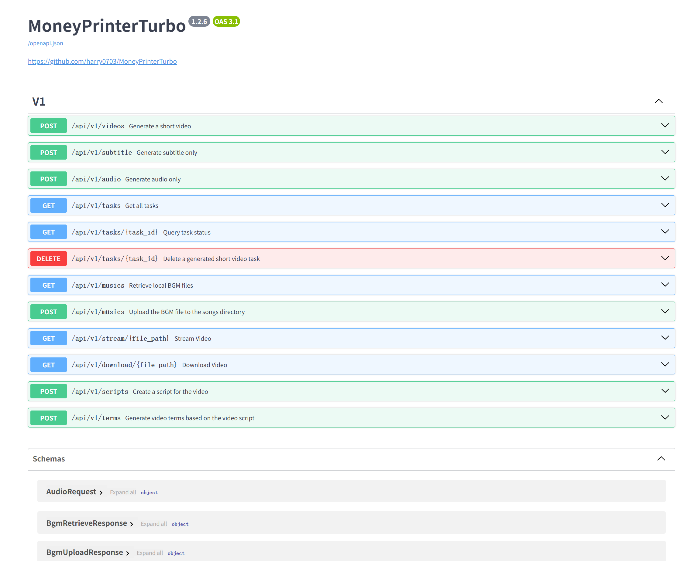

### 配置 n8n 节点

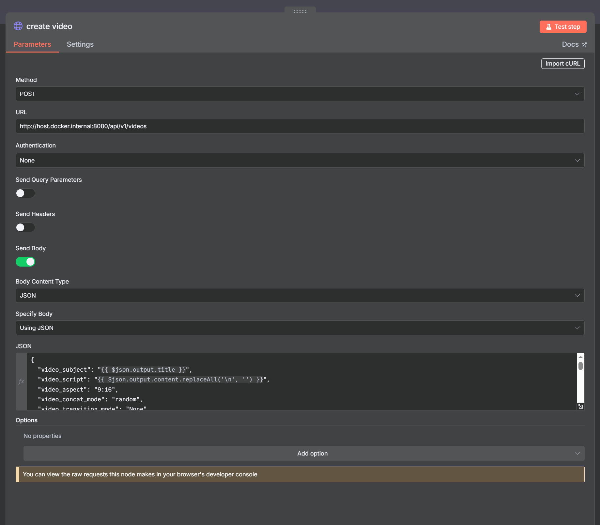

- 接口 URL: `http://host.docker.internal:8080/api/v1/videos` (docker 容器，以 `http://host.docker.internal` baseUrl 访问呢)
- body 参数: 可以 web MoneyPrinterTurbo 测试生成视频，找到输出的参考 `log`

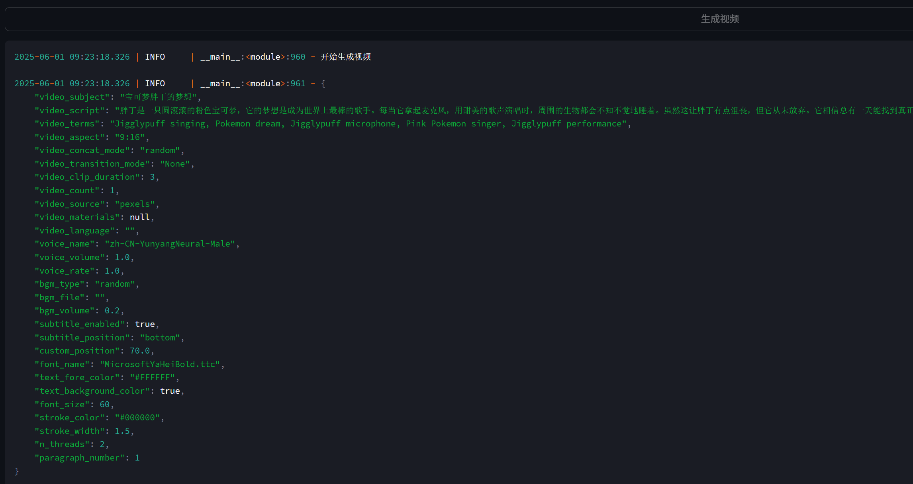

```json
{
  "video_subject": "{{ $json.output.title }}",
  "video_script": "{{ $json.output.content.replaceAll('\n', '') }}",
  "video_aspect": "9:16",
  "video_concat_mode": "random",
  "video_transition_mode": "None",
  "video_clip_duration": 3,
  "video_count": 1,
  "video_source": "pexels",
  "video_materials": null,
  "video_language": "",
  "voice_name": "zh-CN-YunyangNeural-Male",
  "voice_volume": 1.0,
  "voice_rate": 1.0,
  "bgm_type": "random",
  "bgm_file": "",
  "bgm_volume": 0.2,
  "subtitle_enabled": true,
  "subtitle_position": "bottom",
  "custom_position": 70.0,
  "font_name": "MicrosoftYaHeiBold.ttc",
  "text_fore_color": "#FFFFFF",
  "text_background_color": true,
  "font_size": 60,
  "stroke_color": "#000000",
  "stroke_width": 1.5,
  "n_threads": 2,
  "paragraph_number": 1
}
```

## Polling

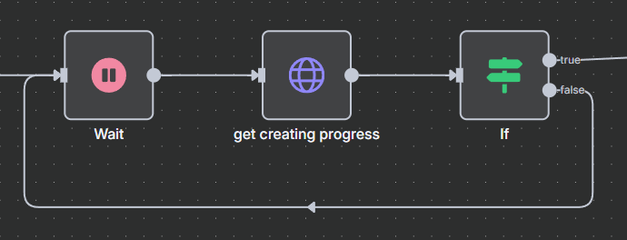

- HTTP 获取 progress: 上述 `/api/v1/videos` 接口会返回 `task_id`，可以轮询请求 `/api/v1/tasks/${task_id}` 接口获取进度等待 100%

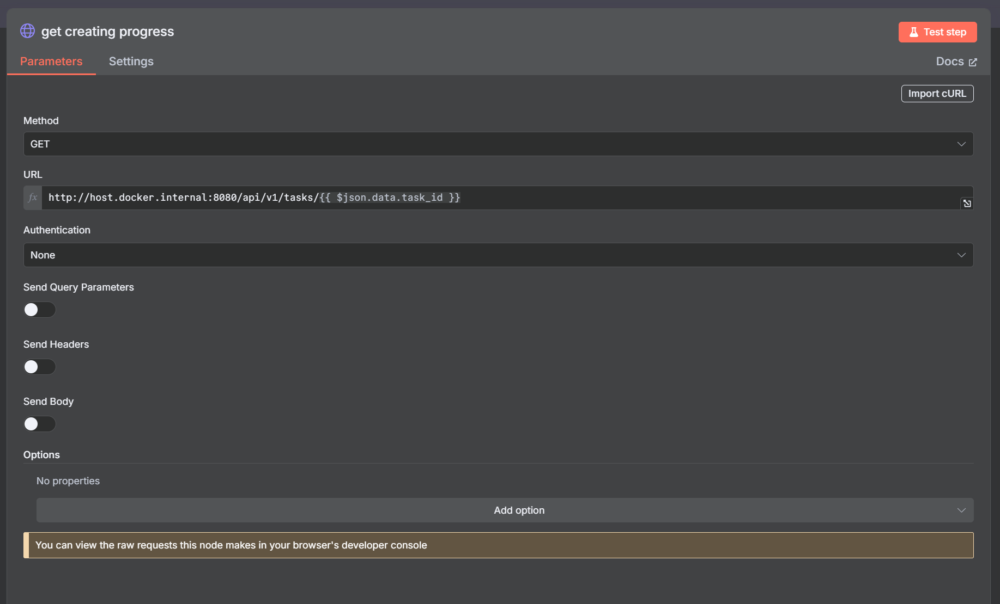

- wait 等待 5s 轮询

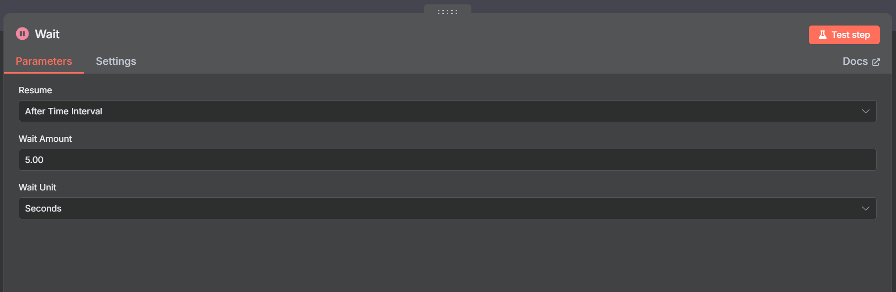

- if 校验是否 `progress === 100`

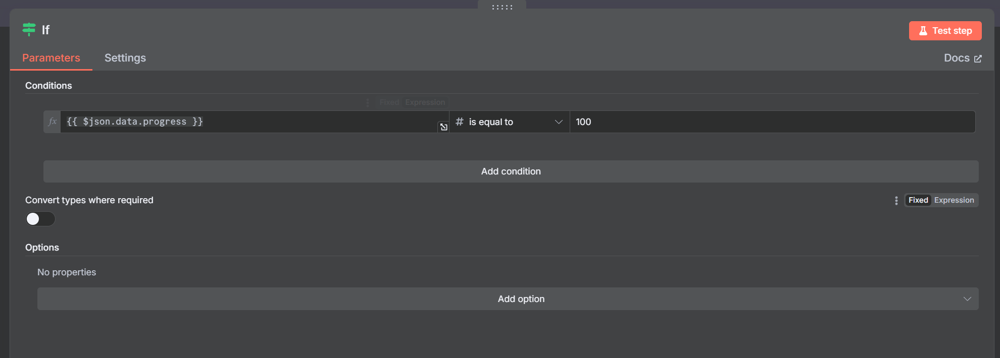

## Download

`progress === 100` 后会返回 video 的 url 字段，直接用 HTTP 请求下载即可

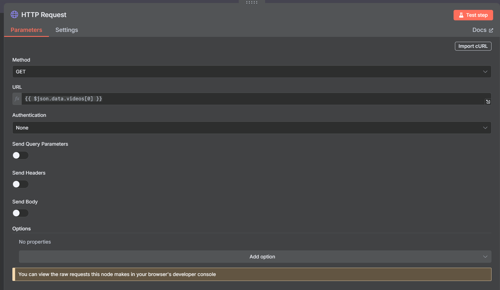