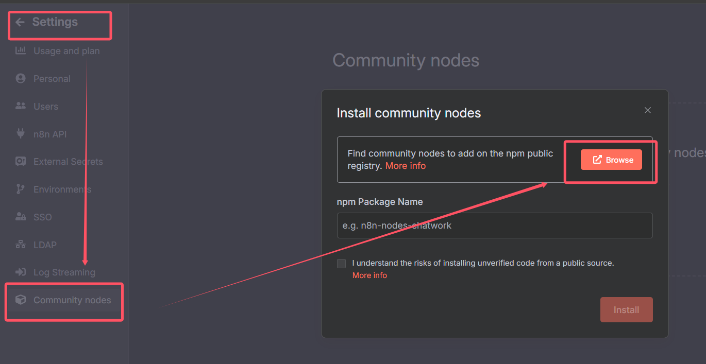

# SendNewsToEmail

## Workflow

- 定时/手动任务: 定时一段时间/手动做一次工作流
- RSS（基于 XML 格式 的订阅协议，用于让用户高效追踪网站更新（如新闻、博客、视频等），而无需手动反复检查）: 捞 Hacker News 新闻
- Limit: 限制、筛选固定条数
- Firecrawl 爬虫: 爬取 Hacker News 拉回来的新闻中的 link 字段的新闻详情地址
- LLM: 大模型，帮忙处理 Firecrawl 爬回来的混乱数据
- Aggregate: 数据汇总，把大模型返回的数据汇总起来（如把大模型返回的 3 条数据合并成 1 条）
- Markdown: MD 转 HTML，大模型返回的数据是 MD 的，需要转 HTML 再发邮件
- Send Email

## 定时/手动触发任务

## RSS Read

获取 Hacker News 的 RSS url:

- 官网: https://hnrss.github.io/
- 方式：有很多方式，这里选择 points

- url: https://hnrss.org/newest?points=5（推送当前点赞数 >=5 的热门帖子）

## Limit

## Firecrawl 爬虫

N8N 节点里没有 Firecrawl，需要去社区找插件

- 安装 Firecrawl

- 创建凭证
    - Firecrawl dev 官方（可用 github 账号登录，每个月有免费额度）: https://www.firecrawl.dev/

## LLM

- 选择 AI Agent

- 大模型自定义 prompt

- 将 Firecrawl 返回的 data 作为 LLM 的 user message

- 定义 system prompt 给 LLM 角色定位

- 添加大模型

- 选择 DeepSeek 配置 API key（得充钱）

## Aggregate

## Markdown

## Send Email

- 邮箱开启 SMTP（Simple Mail Transfer Protocol）: 用于发送电子邮件的标准网络协议，核心作用是将邮件从发送方传递到接收方的邮件服务器（**可以理解为要开启了，才能允许别人（如代码）替你寄信**）

- 邮箱查收

