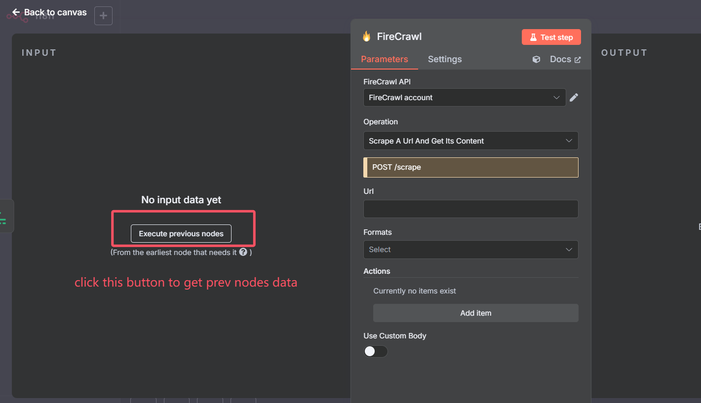
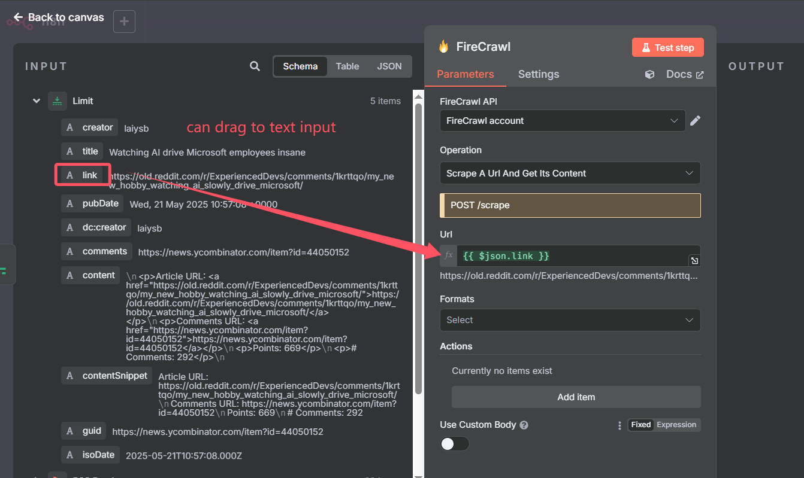
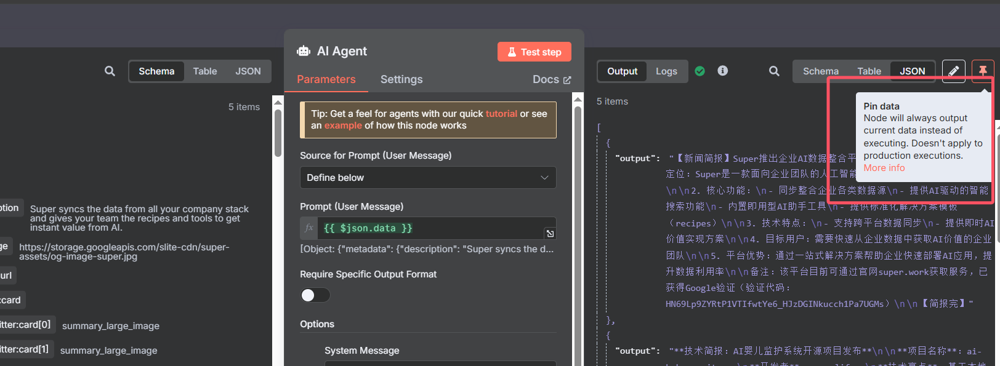
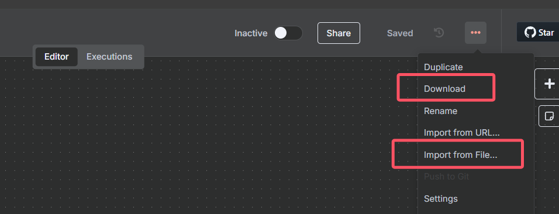
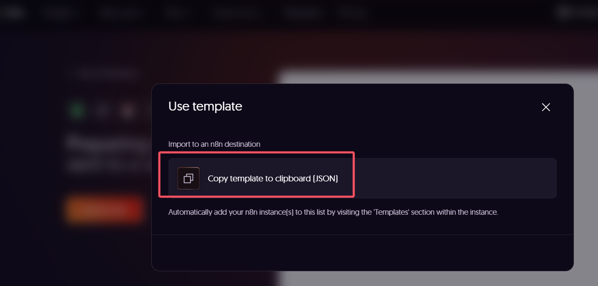

# Some skill actions

## 获取上一个节点数据

## 拖拽到编辑框

## Pin 数据

有时想固定某个接口得数据时，可以用 Pin 将数据固定，这样后续节点都可以使用这个测试数据（如大模型花钱请求的数据，不想每次 test 都去发一次消耗 token，就可以 Pin 固定这个节点）

## Share Workflow

- download 下来 json 文件分享给别人
- import 导入

## 社区资源

- https://n8n.io/workflows 在社区找别人做好的优秀工作流

